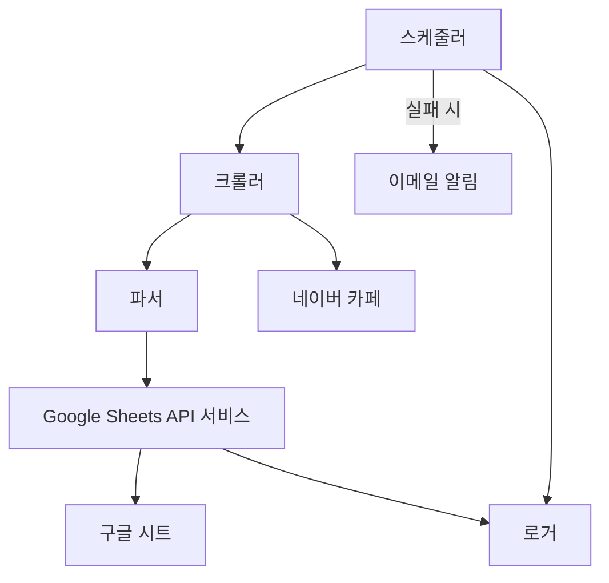

# 기술 요구사항 문서 (TRD)

## 1. 기술 총괄 요약
### 프로젝트 개요
본 프로젝트는 네이버 카페의 챌린지 미션 현황을 매일 00시에 자동으로 확인하여 구글 시트에 `O/X`로 표기하는 자동화 서비스를 구축하는 것을 목표로 합니다. 핵심은 수동 작업을 최소화하고, 운영 효율성을 극대화하는 데 있습니다. 이를 위해 Python 기반의 스크립트와 웹 자동화 도구를 활용하여 네이버 카페에 접근하고, 크롤링된 데이터를 Google Sheets API를 통해 구글 시트에 반영하는 아키텍처를 채택합니다.

### 핵심 기술 스택
Python, Playwright, Google Sheets API v4, Cron, Docker

### 주요 기술 목표
- **성능**: 1~3페이지 크롤링 및 시트 업데이트 2분 이내 완료
- **정확성**: 시트 반영 정확도 99.9% 이상
- **안정성**: 매일 00:00 자동 실행 성공률 99% 이상
- **보안**: 자격 증명 암호화 저장 및 HTTPS 통신
- **확장성**: 주차 및 페이지 수 증가 시 5만 게시글까지 대응 가능하도록 설계

### 주요 기술 가정
- 네이버 카페의 HTML 구조는 급격하게 변경되지 않으며, 변경 시 대응 가능한 수준으로 가정합니다.
- Google Sheets API의 호출 제한은 현재 요구사항을 충족하는 범위 내에서 발생하지 않거나, 발생 시 적절한 재시도 및 지연 전략으로 극복 가능하다고 가정합니다.
- 2차 인증(OTP) 처리는 Playwright를 통한 자동화 또는 쿠키 저장을 통해 우회 가능하다고 가정합니다.

## 2. 기술 스택

| Category | Technology / Library | Reasoning (Why it's chosen for this project) |
| :---------------- | :--------------------------- | :------------------------------------------- |
| **주요 언어** | Python | 빠른 개발 속도, 다양한 라이브러리 지원(웹 크롤링, API 연동), 스크립트 자동화에 적합 |
| **웹 자동화** | Playwright | Selenium 대비 경량화, 비동기 지원, 다양한 브라우저 지원, 스텔스 모드 구현 용이, 네이버 로그인 및 크롤링에 최적 |
| **Google API 연동** | Google Sheets API v4 | 구글 시트 데이터 읽기/쓰기 공식 API, 안정적이고 강력한 기능 제공 |
| **스케줄링** | Cron | Linux/Unix 기반 시스템에서 가장 보편적이고 안정적인 스케줄러, Docker 환경에서 쉽게 통합 가능 |
| **환경 격리/배포** | Docker | 개발/운영 환경 일관성 유지, 의존성 관리 용이, 배포 및 확장에 유리 |
| **로깅** | `logging` (Python 표준 라이브러리) | 별도 라이브러리 없이 기본적인 로깅 기능 제공, 경량화 및 유지보수 용이 |
| **설정 관리** | `configparser` 또는 `json` (Python 표준 라이브러리) | 간단한 설정 파일 관리에 적합, 외부 라이브러리 의존성 없음 |
| **보안 (자격 증명)** | 환경 변수 / AWS Secrets Manager (향후) | 민감 정보의 코드 내 하드코딩 방지, 초기에는 환경 변수 사용, 확장 시 전문 솔루션 고려 |
| **알림** | `smtplib` (Python 표준 라이브러리) | Cron 실패 시 이메일 알림을 위한 간단한 SMTP 클라이언트 기능 제공 |

## 3. 시스템 아키텍처 설계

### 최상위 빌딩 블록
- **스케줄러 (Scheduler)**: 매일 00:00 (UTC+9)에 전체 자동화 프로세스를 트리거하는 역할을 합니다. Cron 기반으로 동작하며, 실행 로그를 기록하고 실패 시 알림을 보냅니다.
- **크롤러 (Crawler)**: 네이버 카페에 자동 로그인하고, 지정된 게시판의 게시글을 순회하며 필요한 데이터를 추출합니다. Playwright를 사용하여 웹 자동화를 수행합니다.
- **파서 (Parser)**: 크롤러가 수집한 게시글 데이터(제목, 작성자, 본문)에서 `*주차` 키워드와 작성자 닉네임을 정규식을 활용하여 추출하고 정제합니다.
- **Google Sheets API 서비스 (GSheets API Service)**: 파싱된 데이터를 기반으로 구글 시트에 접속하여, 사전 정의된 Sheet ID, 사용자명 행, 주차 열에 `O` 또는 `X`를 기록합니다. Google Sheets API v4를 사용합니다.
- **로거 (Logger)**: 시스템의 모든 주요 동작(로그인 시도, 크롤링 결과, 시트 업데이트 결과, 오류 등)을 기록합니다.

### 최상위 컴포넌트 상호작용 다이어그램



- **스케줄러**는 정해진 시간에 **크롤러**를 실행하여 네이버 카페 자동화 프로세스를 시작합니다.
- **크롤러**는 **네이버 카페**에 접속하여 게시글 데이터를 수집하고, 수집된 데이터를 **파서**에게 전달합니다.
- **파서**는 전달받은 데이터를 가공하여 **Google Sheets API 서비스**가 처리할 수 있는 형태로 변환합니다.
- **Google Sheets API 서비스**는 가공된 데이터를 기반으로 **구글 시트**에 접근하여 데이터를 업데이트하고, 모든 작업 과정은 **로거**에 기록됩니다.
- **스케줄러**는 실행 결과 및 오류 발생 시 **로거**에 기록하고, 중요한 실패의 경우 **이메일 알림**을 발송합니다.

### 코드 조직화 및 컨벤션
**도메인 중심 조직화 전략**
- **도메인 분리**: 비즈니스 도메인별로 코드를 구성합니다. (예: `naver_crawler`, `google_sheets`, `scheduler`, `core`)
- **계층 기반 아키텍처**: 각 도메인 내에서 관심사를 분리하여 계층을 나눕니다. (예: `services`, `utils`, `models`)
- **기능 기반 모듈**: 특정 기능과 관련된 모든 요소를 하나의 모듈 또는 디렉토리에 함께 배치합니다.
- **공유 컴포넌트**: 공통 유틸리티, 타입 정의, 재사용 가능한 컴포넌트는 별도의 `shared` 또는 `common` 모듈에 위치시킵니다.

**범용 파일 및 폴더 구조**
```
/
├── src/
│   ├── main.py                     # 메인 실행 스크립트 (스케줄러 진입점)
│   ├── config.py                   # 설정 로드 및 관리
│   ├── core/
│   │   ├── exceptions.py           # 사용자 정의 예외
│   │   ├── logger.py               # 로깅 설정 및 유틸리티
│   │   └── security.py             # 자격 증명 암호화/복호화
│   ├── naver_crawler/
│   │   ├── __init__.py
│   │   ├── service.py              # 네이버 카페 크롤링 및 로그인 로직
│   │   └── models.py               # 네이버 게시글 관련 데이터 모델
│   ├── google_sheets/
│   │   ├── __init__.py
│   │   ├── service.py              # 구글 시트 연동 로직
│   │   └── models.py               # 구글 시트 관련 데이터 모델
│   ├── parser/
│   │   ├── __init__.py
│   │   └── service.py              # 게시글 데이터 파싱 로직
│   ├── scheduler/
│   │   ├── __init__.py
│   │   └── service.py              # 스케줄링 및 알림 로직
│   └── shared/
│       ├── __init__.py
│       └── utils.py                # 공통 유틸리티 함수
├── tests/                          # 테스트 코드
│   ├── unit/
│   ├── integration/
├── config/
│   └── settings.ini               # 설정 파일 (민감 정보 제외)
├── data/
│   └── credentials.json            # Google API 서비스 계정 키 (환경 변수 또는 Secrets Manager 권장)
├── .env                            # 환경 변수 (민감 정보)
├── Dockerfile                      # Docker 이미지 빌드 파일
├── requirements.txt                # Python 의존성 목록
├── README.md                       # 프로젝트 설명
```

### 데이터 흐름 및 통신 패턴
- **클라이언트-서버 통신 (내부)**:
    - 스케줄러는 내부적으로 크롤러, 파서, Google Sheets API 서비스 모듈의 함수를 호출하는 방식으로 통신합니다.
    - 각 서비스 모듈은 필요한 데이터를 함수 인자로 전달받고, 처리 결과를 반환합니다.
- **클라이언트-서버 통신 (외부)**:
    - **네이버 카페**: Playwright를 통해 HTTP/HTTPS 프로토콜로 네이버 서버와 통신합니다. 로그인 요청, 게시판 페이지 요청, 게시글 본문 요청 등이 포함됩니다.
    - **Google Sheets API**: HTTPS 프로토콜을 통해 Google API 서버와 통신합니다. OAuth 2.0 또는 서비스 계정 인증을 사용하여 시트 읽기/쓰기 요청을 보냅니다.
- **데이터베이스 상호작용**:
    - 본 프로젝트는 별도의 영구 데이터베이스를 사용하지 않습니다. 모든 데이터는 크롤링 시점에 메모리에서 처리되고, 최종 결과는 구글 시트에 반영됩니다.
- **외부 서비스 통합**:
    - **Google OAuth**: Google Sheets API 접근을 위한 인증 메커니즘으로 사용됩니다. 서비스 계정 또는 사용자 인증 정보(최초 1회 인증 후 토큰 저장)를 활용합니다.
    - **네이버 로그인**: Playwright를 통해 웹 페이지에서 직접 ID/PW를 입력하고 2차 인증(OTP 또는 쿠키)을 처리하는 방식으로 진행됩니다.
    - **이메일 알림**: Python의 `smtplib`를 사용하여 SMTP 서버를 통해 이메일을 발송합니다. (SendGrid와 같은 외부 서비스는 향후 확장 시 고려)
- **실시간 통신**:
    - 본 프로젝트에서는 실시간 통신(WebSocket, SSE)이 필요하지 않습니다. 모든 작업은 스케줄러에 의해 주기적으로 실행되는 배치 작업입니다.
- **데이터 동기화**:
    - 구글 시트가 최종적인 데이터 저장소 역할을 합니다. 크롤링 및 파싱된 데이터는 구글 시트에 직접 반영되어 동기화됩니다. 충돌 발생 시 Google Sheets API의 기본 동작(덮어쓰기)을 따르며, 재시도 로직으로 일관성을 유지합니다.

## 4. 성능 및 최적화 전략

- **병렬 처리 최소화**: 초기 MVP 단계에서는 복잡한 병렬 처리를 지양하고, 순차적인 실행을 통해 안정성을 확보합니다. 필요 시 Playwright의 비동기 기능을 활용하여 I/O 바운드 작업을 최적화합니다.
- **선택적 크롤링**: 지정된 1~3페이지 내에서만 크롤링을 수행하여 불필요한 네트워크 요청을 줄입니다. 게시글 제목에 `*주차` 키워드가 없는 경우 본문 파싱을 건너뛰어 처리 시간을 단축합니다.
- **Google Sheets API 배치 업데이트**: 개별 셀 업데이트 대신 `spreadsheets.values.batchUpdate`와 같은 배치 업데이트 기능을 사용하여 API 호출 횟수를 최소화하고 성능을 향상시킵니다.
- **재시도 및 지연 전략**: 네트워크 오류, API 호출 제한 등에 대비하여 지수 백오프(Exponential Backoff)를 포함한 재시도 로직을 구현하여 안정성을 높입니다.
- **리소스 최적화**: Docker 컨테이너의 메모리 및 CPU 사용량을 모니터링하고, 불필요한 의존성을 제거하여 경량화된 환경을 유지합니다. Playwright 브라우저 인스턴스는 작업 완료 후 반드시 종료하여 리소스를 해제합니다.

## 5. 구현 로드맵 및 마일스톤

### Phase 1: 기반 구축 (MVP 구현)
- **핵심 인프라**: Python 개발 환경, Dockerfile 구성, 기본 프로젝트 구조 설정
- **필수 기능**:
    - 네이버 자동 로그인 (ID/PW, 2차 인증 처리 - Playwright 활용)
    - 지정 게시판 1페이지 크롤링 (제목, 작성자, 본문 파싱)
    - 구글 시트 업데이트 (사전 정의된 Sheet ID, 사용자명 행, 주차 열에 `O` 기록)
- **기본 보안**: 자격 증명 환경 변수 또는 설정 파일 분리
- **개발 환경 설정**: 로컬 개발 환경 구성, `requirements.txt` 관리
- **예상 기간**: 4주

### Phase 2: 기능 확장
- **고급 기능**:
    - 카페 게시글 크롤링 범위 확장 (1~3페이지 순회)
    - `*주차` 키워드와 작성자 닉네임 추출 로직 고도화
    - 구글 시트 업데이트 로직 개선 (`O` 기록, 없으면 `X` 기록)
    - 스케줄러 구현 (Cron 기반, 매일 00:00 UTC+9 자동 실행)
    - 실행 로그 저장 기능 구현
    - 실패 시 이메일 알림 기능 구현
- **성능 최적화**: Google Sheets API 배치 업데이트 적용
- **향상된 보안**: 자격 증명 암호화 저장 (AES256)
- **예상 기간**: 3주

### Phase 3: 확장 및 최적화
- **확장성 구현**: 5만 게시글 대응을 위한 크롤링 및 파싱 로직 최적화 (메모리 효율성)
- **고급 통합**: (선택 사항) AWS Secrets Manager 연동을 통한 자격 증명 관리
- **모니터링 구현**: 실행 성공률, 시트 반영 시간 등 주요 지표 로깅 및 모니터링 준비
- **배포**: Docker 이미지 빌드 및 AWS ECS 또는 EC2 배포 스크립트/가이드 작성
- **예상 기간**: 2주

## 6. 위험 평가 및 완화 전략

### 기술 위험 분석
- **기술 위험**: 네이버 보안 정책 변경 → 크롤링 차단
    - **완화 전략**: Playwright의 스텔스 모드 및 헤더 조작을 통해 봇 탐지 회피 시도. 쿠키 기반 로그인 유지 스크립트 구현. 주기적인 모니터링 및 변경 감지 시 빠른 코드 업데이트.
- **성능 위험**: 00시 트래픽 집중 → 실행 지연
    - **완화 전략**: Playwright의 `headless` 모드 사용으로 리소스 절약. Google Sheets API 배치 업데이트 적용. 크롤링 및 시트 업데이트 로직 최적화. 재시도 로직에 지연 시간 추가.
- **보안 위험**: 사용자 인증정보 유출
    - **완화 전략**: 네이버 ID/PW 및 Google API 키는 환경 변수 또는 암호화된 파일로 저장. 코드 내 하드코딩 금지. AES256 암호화 적용. HTTPS 통신 강제. (향후 AWS Secrets Manager와 같은 전문 솔루션 도입 고려)
- **통합 위험**: Google API 호출 제한
    - **완화 전략**: Google Sheets API의 할당량 및 사용량 모니터링. 배치 업데이트를 통한 API 호출 횟수 최소화. API 호출 실패 시 지수 백오프를 적용한 재시도 로직 구현.

### 프로젝트 전달 위험
- **일정 위험**: 개발 일정 지연
    - **완화 전략**: 각 Phase별 명확한 목표 설정 및 주간 진행 상황 공유. PoC를 통해 초기 기술 위험을 최소화. 핵심 기능 우선 개발 (MVP).
- **자원 위험**: 개발 인력 부족 또는 기술 전문성 부족
    - **완화 전략**: Python, Playwright, Docker 등 핵심 기술에 대한 팀원 교육 및 스터디 진행. 필요한 경우 외부 전문가 자문 고려.
- **품질 위험**: 코드 품질 저하 및 버그 발생
    - **완화 전략**: 코드 리뷰 프로세스 도입. 단위 테스트 및 통합 테스트 작성. CI/CD 파이프라인 구축을 통한 자동화된 테스트 실행.
- **배포 위험**: 프로덕션 환경 배포 문제
    - **완화 전략**: Docker를 통한 개발/운영 환경 일관성 유지. 단계별 배포 전략 (개발 → 스테이징 → 프로덕션). 롤백 계획 수립.
- **비상 계획**:
    - 자동화 시스템 장애 시, 수동으로 네이버 카페 확인 및 구글 시트 업데이트를 수행할 수 있는 비상 절차 마련.
    - 주요 오류 발생 시 개발팀에 즉시 알림이 가도록 모니터링 및 알림 시스템 구축.